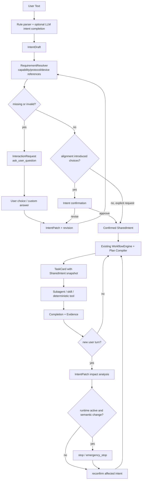

# DeepRadio Workflow 算法 V2

> 更新日期：2026-08-31<br>
> 读者：算法、Agent、Workflow 和评测开发人员<br>
> 约束：保留当前 WorkflowEngine、IntentIR、Catalog、Plan Compiler、SharedState、Completion 和执行器，只优化其输入输出契约与决策规则。

---

## 0. 2026-08-31 增量：泛化链路硬化（V6，已实施）

- 自然语言轮次由单一 LLM 语义入口生成 relation、confirmation decision 和增量 intent patch；同一句输入不再被 Alignment 与 Workflow 重复分类。携带 checkpoint id 与 decision 的按钮命令仍走确定性命令入口。
- 已确认或已结束 Workflow 后的 action-bearing 文本重新进入 WorkflowEngine，由 TurnIR 决定 continuation/new task/deploy；只有“纯确认且无 action/参数”的孤立确认会被安全拒绝。
- LLM planner 仅在具体 operation/evidence 存在 coverage gap 时调用。Compiler 允许补齐 Registry/Catalog 可绑定动作，但禁止提高 effect、改写既有 producer/dependency/completion、删除已授权 RF tail 或安全 finalizer。
- Effect ≥ DEVICE_CONFIG 的执行必须在前序证据中同时具备 host readiness、physical discovery、exact probe 和 explicit grant；任何非 finalizer RF_RUN 后必须存在 RF_RUN safety finalizer。
- `hardware_preflight` 只证明 host/environment readiness，明确不证明设备存在。设备事实只能由 `discover_devices + probe_device` 建立；失败的新探测会清除旧 observed-device 投影。
- `workflow_presenter.py` 是默认 GTK 的英文展示边界。按钮文案、等待说明、Stage/Task label 和状态文案在 presenter 中生成；raw ids、revision、completion map 和 evidence JSON 不进入默认用户界面。

以下 V5 章节保留为历史演进记录；其中“生产路径使用规则/正则语义兜底”的描述已被本节取代。

## 0. 2026-08-30 增量：槽位规范化与硬件探测路由算法（V5，已实施）

### 0.1 问题分析

V5 实测（"I want to use plutosdr to transmit ble signal."，PlutoSDR 在位）暴露：

1. 意图 LLM 可能把设备型号放进 `device` 等非规范键，规则层与 LLM 层各持一个"设备"槽位，合并后互相不认：missing 判定失败、规格卡重复行、第一轮重复追问。
2. LLM 偶发漏提取已陈述的结构化事实（如 hardware），旧合并逻辑直接丢弃规则种子，用户被迫重答自己说过的话。
3. 硬件探测不感知意图的设备选择：空参落入工具默认 `b210`，对 IIO 家族的 PlutoSDR 反复跑 UHD 命令，三次失败且无矛盾解释。

### 0.2 槽位合并的规范化算法

合并优先级（自上而下，上层存在则下层不参与）：

```text
用户显式事实（slot_sources ∈ user/user_text）
> LLM 返回键（归一后）
> 字面证据种子兜底（rules 种子，仅白名单键 + 字面证据）
> 协议/语义默认（protocol_default / safety_default）
```

规则：

1. **规范键名**：意图 prompt 要求设备型号必须写 `hardware`；`device/sdr/radio` 等同义键在 `_merge` 内按别名表归一到 `hardware`。归一不改来源：LLM 返回记 `llm`，规则种子记 `rules`。
2. **LLM 优先**：LLM 返回的键覆盖同键规则种子（安全键除外，安全键遵守既有不可覆盖规则）。
3. **字面证据种子兜底**：LLM 未返回键 `k` 时，若满足全部条件则回填规则种子：
   - `k ∈ _SEED_FALLBACK_KEYS`（hardware、protocol、direction、modulation、carrier_frequency、sample_rate、bandwidth、ble_mode、advertising_channels）；
   - 种子值非空；
   - 种子值的字符串形式（小写、忽略 `-_`/空格）是用户 `raw_text` 的子串。
4. **永不兜底**：自由文本键（local_name、payload——高误报）与安全键（operation、deploy_permission、duration——授权语义不得来自 regex 猜测）。
5. **V4 契约保留**：兜底不升格 source，无字面证据的猜测仍随 LLM 漏提取一起丢弃（`test_llm_omission_drops_nonconflicting_rule_candidates` 守护）。

设计意图：字面证据条件把兜底收敛为"用户确实说过这个词"，既消除重复追问，又不会把 regex 幻觉变成用户事实。

### 0.3 硬件探测路由算法

```text
discover_devices(device_type)
  ↓ device_type := intent.slots["hardware"]（adapter 重试预检传入；
    空才用工具默认，默认值不得屏蔽用户选择）
  ↓ resolve_hardware_profile → driver_family + 家族命令
  ↓ 执行家族命令（pluto→iio_info -S usb；b210/usrp→uhd_find_devices；…）
  ├─ 命中（output_indicates_device）→ device_found=true，零额外开销
  └─ 未命中 → _scan_other_families（跳过同 driver_family）
        ├─ 其它家族命中 → devices=[{device_type, device_identity, label}]
        │   + mismatch_hint（"期望 X 但发现 Y，请确认设备选择或物理连接"）
        │   device_found=false（不冒充期望设备成功）
        └─ 全未命中 → 常规"未检测到设备"

adapter._refresh_hardware_for_retry（Retry 前预检）
  ↓ 失败 → intent.context["hw_retry_failures"] += 1
  │    提示 := mismatch_hint 或通用文案
  │    failures ≥ 2 → 追加 _diagnose_hardware_mismatch（LLM 咨询）：
  │        输入 = 期望类型 + 命令 + 输出 + 发现设备
  │        输出 = "Diagnosis: 原因 | 建议"；LLM 不可用 → 静默降级
  └─ 成功（含 probe 通过）→ 计数清零，继续原重试流
```

约束：

- 跨家族扫描严格只读，不配置、不启动设备。
- LLM 诊断纯咨询性：不改变 Stage 状态机、不阻塞 Retry、不产生任何 effect。
- mismatch_hint 是"事实差异陈述"，不替用户改意图：期望设备仍以 intent 为准。

## 1. Alignment Gate、SharedIntent 与动态重编织（2026-08-29，已实施）

### 1.1 问题分析

1. 当前 Intent 能提取槽位，但"规则/LLM 推断出的草案""用户已经确认的意图""Workflow 内执行快照"边界不够清楚。
2. 缺参逻辑分散在 `WorkflowEngine._missing_slots` 和对话文案中，无法用通信参考资料统一解释字段来源、候选项和默认值。
3. Subagent/skill 主要收到 Workflow Intent 和 TaskCard，缺少稳定的共享意图版本，无法证明执行没有偏离用户确认目标。
4. 用户在执行中修改参数时，旧链路可以合并槽位，但没有统一的 IntentPatch 影响分析，无法可靠决定只改后续、失效产物、重建 Workflow，或先停止 RF。
5. 诊断分类容易把"硬件接入问题"错误地要求为"必须有当前 `.grc`"，且各诊断维度没有统一 `pass/fail/unknown` 口径。

### 1.2 目标算法



主框架不变：`GUI/API → ServiceAgent → WorkflowEngine → StageExecutor`。新增的是 Workflow 之前的 `IntentAlignmentCoordinator` 和旁路的 `analyze_intent_patch`，不是第二套 Stage 编排器。

### 1.3 SharedIntent 算法契约

`SharedIntent` 是用户目标的单一事实源，至少包含：

```text
intent_id, revision, status, raw_text
task_type（兼容评测标签）, capabilities
parameters + parameter_sources
goals, constraints, success_criteria
missing_fields, validation_errors, assumptions
intent_ir, semantic_hash, patch_history
```

状态精简为：`idle → draft → awaiting_input → awaiting_confirmation → confirmed`，旧意图被新任务替代时可标记 `superseded`。这些是**意图状态**，不是 Task/Stage 执行状态。Task/Stage 仍使用现有 `pending/running/waiting/completed/errored/invalidated`。

写权限规则：

- `IntentAlignmentCoordinator` 是唯一直接写者；
- 用户通过结构化 `InteractionResponse` 或文本回答触发写入；
- MainAgent 负责协调和确认；
- Subagent/skill 只读 TaskCard 中的快照，只能返回候选 `IntentPatch`；
- GUI 不直接编辑 JSON 文件，而是提交带 `interaction_id + base_intent_revision` 的命令；
- 过期 revision 的回答必须拒绝，防止覆盖新意图。

`TaskCard` 与 `ResultEnvelope` 同时携带 `intent_id / intent_revision / intent_hash`。因此可以检查任意结果是否基于用户确认的同一版本。

### 1.4 RequirementResolver 规则

参考资料放在运行时知识目录 `grc/agent/knowledge/specs/`，与论文、开发文档和 agent prompt 分离。规则必须按 capability/protocol/effect 声明，禁止按七个测试句或固定结果写死。

当前通用规则：

- 需要 `hardware_configure/hardware_runtime/deploy` 时要求设备、中心频率和采样率；
- BLE 外部接收验收要求 `local_name`；
- RX BER 要求 Eb/N0；
- 软件诊断需要当前工程，明确的硬件接入诊断不要求 `.grc`；
- 协议默认、安全默认和用户输入分别记录来源，默认值不伪装成用户决定；
- missing 判定发生在**别名归并与种子兜底之后**：用户已字面陈述的结构化事实不算 missing（V5）。

LLM 适合提取目标、复合约束和开放字段；RequirementResolver 负责确定"是否足以执行"，Policy 负责"是否允许执行"。三者不可合并。

### 1.5 IntentPatch 与影响范围

影响分析由确定性字段规则完成，LLM 只提出候选变化：

| 变化 | scope | 动作 |
|---|---|---|
| 语言/解释档位 | `presentation_only` | 不改变 Workflow |
| 只影响尚未执行的展示或可选项 | `future_only` | 修改未来计划 |
| 名称、频率、采样率、带宽、payload、Eb/N0 | `downstream` | 失效相关产物和后续证据，重新确认 |
| 协议、调制、方向、硬件、operation、来源域 | `supersede` | 替代原语义计划并重新编织 |

只要活动 runtime 中发生非展示变化，必须先 stop，再应用 patch。任何旧 `RF_RUN` grant 都不能自动迁移到新 intent revision。

### 1.6 诊断算法

诊断输出统一为 `diagnosis_report.json`，每项包含：

```text
check_id, dimension, status(pass/fail/unknown), observation,
evidence_grade, remediation, requires_human
```

维度至少覆盖 intent、environment/driver、device discovery、requested/observed identity、exact probe、parameters、project、runtime、RF path、OTA。无法由主机证明的天线/线缆/衰减器/端口连接必须为 `unknown + requires_human`，除非存在回环、功率计、频谱仪或独立 sniffer 证据。

V5 补充：硬件重试链路的 LLM 咨询诊断（0.3 节）是提示层能力，与结构化 `diagnosis_report.json` 互补，不共享 schema、不写状态。

### 1.7 修改与测试顺序

正确顺序不是"算法全部做完再测试"，而是：先冻结真实短输入和多轮对话数据集；为 SharedIntent/Interaction/Policy 写红色契约测试；实现 Alignment Gate；通过单元和离线集成测试；再做 UI 人工实验；最后做只读硬件和有限 RF 实验。七类单句 happy path 作为回归集保留，但不再是主要鲁棒性证据。

## 2. 当前算法是什么

DeepRadio 当前不是纯 ReAct，也不是固定七条脚本，而是一个受约束的混合规划系统：

```text
User Text
→ 规则解析：实体、槽位、否定约束、能力初值
→ 可选 LLM Intent 校正：目标、约束、产物、Evidence、operation
  （V5：输出前先做别名键归一；漏提取时对白名单键做字面证据种子兜底）
→ capability fragments / Task 兼容标签组成候选 Stage
→ 可选 LLM short-horizon plan
→ deterministic Plan Compiler：action allowlist、effect、决策截断、安全尾部
→ deterministic handler 或 LLM subagent
→ Completion
→ Workflow transition
→ SharedState / Claim / Artifact / GUI
```

七类 `task_type` 用于评测和选择当前 Catalog 片段，不应改写用户目标。LLM 可以补全 Intent 和提出计划，但不能发明 Registry 外的 action，也不能绕过 Policy、Completion、设备授权和停止能力。

0827 V3 与 0828 V2 的事件表明：输入先进入 `user_turn_received`，之后才生成 Intent 和 Workflow；Task7 与 BLE 的 `operation` 明确来自 `llm`。所有实际 Stage 均记录为 `mode=deterministic`、`executor=deterministic_stage_handler`。因此当前实验的准确说法是"LLM 参与理解和受限规划，确定性工具负责执行"，不是直接导入，也不是 LLM subagent 自主执行。

---

## 3. 不改变框架的目标算法

```text
Next = F(
  current_workflow,
  shared_engineering_facts,
  user_turn_and_decision,
  feedback_impact_scope,
  executable_capabilities,
  policy_and_evidence_gates
)
```

优先级：

```text
用户明确事实与否定约束
> 安全和设备事实
> 当前工程事实
> 已批准且尚未完成的安全尾部
> LLM 推断
> 默认值
```

任何 LLM 输出都只能作为候选 IR 或候选 Plan，最终执行权仍由 Compiler、Policy 和 Completion 决定。字面证据种子兜底回填的值属于"用户明确事实"层（用户原文陈述），不是 LLM 推断层（V5）。

---

## 4. Intent 算法

### 4.1 两阶段 Intent

第一阶段保留现有规则分类，提取：

- 明确实体：调制、协议、设备、频率、采样率、时长、local name；
- 操作：build、modify、diagnose、observe、configure、deploy、stop；
- 否定与边界：只仿真、不接硬件、先不修改、停在确认、最长时长；
- 当前工程和 runtime 上下文。

第二阶段调用 LLM 校正开放语义，输出 IntentIR：

```json
{
  "goals": [],
  "requested_operations": [],
  "desired_artifacts": [],
  "evidence_requirements": [],
  "constraints": {},
  "decision_boundaries": [],
  "stop_conditions": [],
  "capabilities": [],
  "slots": {},
  "task_type": "compatibility_label"
}
```

合并规则：

1. `slot_sources=user/current_project/safety_default/protocol_default` 不被 LLM 覆盖；
2. LLM 不能删除用户明确否定；
3. `task_type` 不得反向改写 goals；
4. LLM 不可用或输出非法时沿用规则 Intent；
5. 每轮记录规则初值、LLM 是否调用、是否采用、模型和 hash；
6. 槽位键先归一到规范名（`device→hardware` 等）再合并；LLM 漏提取的白名单键按字面证据种子兜底回填，来源保持 `rules`，安全键与自由文本键除外（V5，细则见 0.2）。

### 4.2 增加来源域，不增加 Task 类型

为解决"当前接收信号"的歧义，增加通用槽位：

```text
signal_source_scope =
  current_project_offline
  | live_device
  | generated_fixture
```

决策规则：

- 明确出现 Pluto/B210/天线/实时接收时选择 `live_device`；
- 明确"当前工程、只仿真、离线数据"时选择 `current_project_offline`；
- 为 BER/EVM 自包含校验而生成参考 TX/RX 时选择 `generated_fixture`；
- 文本和上下文均无法确定时进入 alignment，不猜测。

这避免为每种设备或观察句式新增 Task。

---

## 5. 计划与编译算法

### 5.1 候选计划

现有 Catalog/能力片段继续提供可执行 Stage；LLM planner 只在 `allowed_actions` 内排序和补充目标。初始 Workflow 只物化到下一个用户决策边界，剩余计划放入 deferred。

### 5.2 Effect 必须从实际工具反推

```text
stage.effect = max(
  catalog_effect,
  compiler_effect,
  effects_of_bound_tools
)
```

因此：

- 读工程、仿真测量：`READ`；
- 写入或替换 `.grc`：至少 `ARTIFACT_WRITE`；
- 探测设备（含 V5 跨家族只读扫描）：`DEVICE_READ`；
- arm/configure：`DEVICE_CONFIG`；
- start/stop RF：`RF_RUN`。

LLM 不得把高副作用工具降级为 `READ`。

### 5.3 决策点按目的区分

保留 Checkpoint 对象，增加 `purpose`：

```text
config_handoff     交付已保存配置，不授予 RF
project_mutation   允许工程写入
rf_authorization   只授权绑定设备、参数和时长的 RF 计划
ota_observation    记录外部接收结果，不授予设备操作
```

`approved` 只解决当前 checkpoint。只有 `rf_authorization` 可以加入 `RF_RUN` granted effect。

---

## 6. Stage 执行选择

```text
if Stage 涉及设备、安全、文件事务、协议位级算法或确定性测量:
    deterministic handler
elif Stage 需要开放语义解释且 LLM 可用:
    llm_subagent
else:
    deterministic fallback 或 waiting
```

确定性执行不是绕过 Agent，而是受控 Agent 的执行后端。UI 和事件必须分别展示：

- Intent 来源：rules / llm / merged；
- Plan 来源：catalog / llm proposal / compiler fallback；
- Stage executor：deterministic handler / llm subagent；
- Tool、耗时、输入输出 hash。

这样既能利用 LLM 的泛化能力，也能说明为什么 BLE、CRC、硬件启动等步骤快速且可复现。V5 的 LLM 失败诊断属于提示层，不构成第三种 executor。

---

## 7. Completion 与 Evidence 算法

修复后分三层：

### 7.1 可执行 Completion

只允许注册 predicate ID：

```text
artifact_exists
flowgraph_parses
structural_validation_passed
measurement_valid
claim_bound_to_current_version
device_identity_matched
runtime_started_for_bound_plan
runtime_terminal_verified
evidence_attached_to_run
```

LLM 生成的自然语言谓词若没有绑定 resolver，则标记 `unbound`，用于 Inspector 解释，不参与 completed 判定。

### 7.2 Outcome、Quality、Evidence grade 分离

```json
{
  "outcome": "passed",
  "quality": "warning",
  "evidence_grade": "human_statement"
}
```

- `outcome`：用户目标是否达成；
- `quality`：运行是否 clean，是否有 underflow/overrun/统计不足；
- `evidence_grade`：结论来自系统测量、人工陈述、附件或独立接收端。

Failed Claim 不应被 Workflow completed 隐藏；它可以使 `quality=warning`，或在其属于硬 Gate 时使 `outcome=failed`。

### 7.3 Measurement 链

```text
raw probe
→ MeasurementRun(measurement_id, parameters, sample_count)
→ report / image
→ Claim Evidence(measurement_id, artifact, project_version)
```

特定测量规则：

- BER 同时报 `errors`、`compared_bits`、对齐方法和有限样本置信上界；
- 频谱峰值报告窗、FFT、采样率、bin、分辨率、是否排除 DC；
- EVM Claim 引用同一次测量的星座或报告，不复制无来源数值。

---

## 8. 修改、诊断与观察规则

### 8.1 修改工程

```text
current project exists
→ inspect semantic graph
→ propose GraphPatch + preserved invariants
→ checkpoint(project_mutation)
→ apply_flowgraph_patch transaction
→ validate + measure affected claims
```

只有用户明确要求重建、或结构不兼容且用户确认影响范围时，才回退 `design_link(recipe)`。不能根据"BPSK→QPSK"这个固定表达直接选择 recipe。

### 8.2 诊断

诊断输出固定结构而非固定结论：

```json
{
  "observations": [],
  "hypotheses": [],
  "experiments": [],
  "ranked_causes": [],
  "recommendations": [],
  "project_unchanged": true
}
```

LLM 可以生成假设和解释；工具负责测量和单因素对照。结论必须引用 observation/experiment，不得写死某个 EVM、CRC 或设备结果。

### 8.3 观察

观察工具由 `signal_source_scope` 决定。离线工程可重新仿真；真实设备必须探测身份并走 RX runtime。输出必须显式标注来源，不能把 fixture 或离线 probe 称为当前空口。

---

## 9. BLE 与 RF 规则

```text
build packet/waveform
→ offline protocol verification
→ discover/probe exact device
→ checkpoint(rf_authorization)
→ configure/arm
→ bounded start
→ checkpoint(ota_observation)
→ stop/finalize
```

约束：

- BLE CRC、白化和 GFSK 由通用算法验证，不绑定某个 local name 或固定结果；
- 发射计划绑定设备 identity、频率、采样率、增益/衰减和最长时长；
- `rf_active` 表示当前是否发射，`rf_ever_started` 表示历史事实；
- `return_code=0`、OTA 接收和流质量分别评价；
- 人工点击"看到"只产生 `human_statement`，附件和独立接收设备提升 Evidence grade；
- 当前只声明单广告信道能力。

---

## 10. 可审计事件

每轮至少产生：

```text
user_turn_received
intent_rule_seeded
intent_llm_started
intent_llm_succeeded | intent_llm_fallback
plan_llm_started
plan_llm_succeeded | plan_llm_fallback
plan_compiled
stage_routed
tool_started / tool_completed
completion_evaluated
state_projected
reply_rendered
```

事件记录 ID、revision、stage、executor、model、latency、hash、effect 和 predicate 结果，不记录 API key。没有模型时仍记录明确的 `*_fallback(reason=not_configured)`。V5 的探测/诊断事件（`discover_devices`、`probe_device`、mismatch 提示与 LLM 咨询诊断）沿用 `tool_started/tool_completed` 通道，不新增事件类型。

---

## 11. 泛化约束

- 不根据七条测试文本做 exact match 或专用 handler。
- Task label 只用于评测和片段选择；最终目标以 IntentIR 为准。
- LLM 可以自由理解目标，但 action、effect 和工具必须经过 Compiler。
- 新协议、新设备通过 Registry、profile 和 capability 扩展，不复制一套 WorkflowEngine。
- 用户反馈只失效受影响的 Stage、Measurement 和 Claim；未受影响结果继续复用。
- 任何默认值都必须带 source，并在影响 RF 或用户目标时可见。
- 种子兜底、跨家族扫描、LLM 咨询诊断都是提示/对齐层能力：无 effect、无写权限、不改变安全门（V5）。

该算法的论文价值不在"LLM 生成了流图"，而在可观察、可逆向干预、受证据约束的动态状态编排：人既能在 checkpoint 控制未来动作，也能通过修改画布改变工程事实并触发局部重规划。
